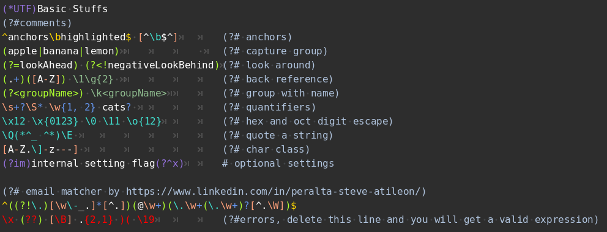

# Godot Regex Syntax Highlighter
Provides you with a highlighter that *semantically* colorizes regular expressions in your game made by [Godot](https://godotengine.org/).  <br>
It follows the [PCRE2](https://www.pcre.org/) standard, exactly the one Godot used.  <br>

As depicted in the picture below.


## Install
If you just want the highlighter...<br>
you can simply copy and paste the script file named `regex_syntax_highlighter.gd` from the repo

If you want the script along with the demo project...<br>
```sh
git clone https://github.com/Silver1078682/Godot-Regex-Syntax-Highlighter.git
```

## Contributions
If you notice any bugs, please feel free to open an issue or PR
**NOTE**: currently the highlighter can only highlight a one-line regex properly, so make sure you are not reporting a bug of a multiline regex

A bug may include:
* a valid regex marked as error
* an invalid regex not marked as error
* other problems

in following occasion you might not open an issue
* It is covered in [known_issues](known_issues.txt)
* a duplicate issue